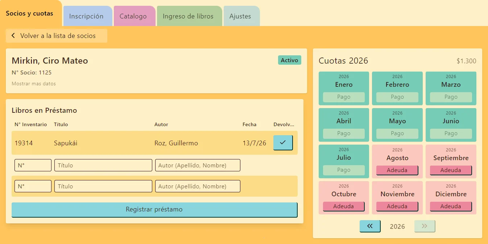
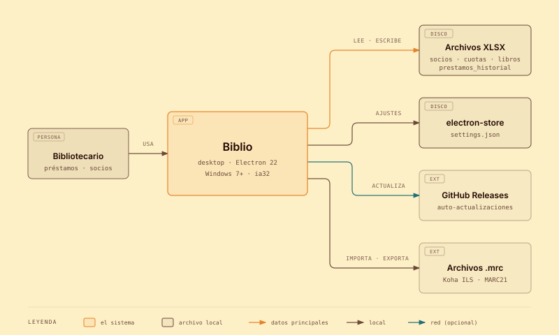
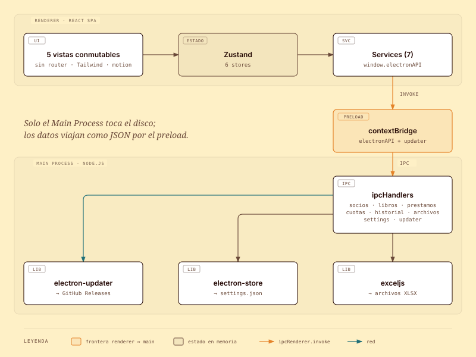

<div align="center">


# Biblio

**Sistema de gestión bibliotecaria de escritorio: préstamos, socios, cuotas e inventario de libros.**

[](https://github.com/CiroMirkin/biblio/releases/latest)
[](https://github.com/CiroMirkin/biblio/actions/workflows/release.yml)

-0078D6?logo=windows)
[](LICENSE)

[Descargar](https://github.com/CiroMirkin/biblio/releases/latest/download/Biblio-Setup.exe) · [Desarrollo](#desarrollo) · [Compilación](#compilación) · [Pruebas](#pruebas) · [Releases](#publicación-de-releases) · [Arquitectura](#arquitectura-c4)



</div>

## Características

- **Préstamos y devoluciones** con historial por socio y por libro.
- **Socios**: inscripción, observaciones, bajas/reactivaciones y socios vinculados.
- **Cuotas** e **inventario de libros**, opcionales según cada biblioteca.
- **Compatible con Koha**: importa y exporta catálogos en archivos `.mrc` (MARC21).
- **Sin internet**: los datos viven en archivos XLSX locales (`socios`, `cuotas`, `libros`, `prestamos_historial`).
- **Liviano**: funciona en Windows 7 (32 bits) y se actualiza solo desde GitHub Releases.

## Desarrollo

### Comandos

| Comando | Acción |
| --- | --- |
| `npm run dev` | Dev server con hot-reload (Vite + Electron) |
| `npm run build` | Compila TS + Vite |
| `npm run dist` | Build + empaqueta con electron-builder (Electron 22, ia32) |
| `npm test` | Ejecuta pruebas sobre los handlers de electron |
| `npm run test:e2e` | Ejecuta pruebas E2E (compila y ejecuta las pruebas) |
| `npm run clean` | Elimina artefactos de compilación (ver abajo) |

`npm run clean` elimina los directorios de compilación `dist-electron`, `dist-ts` y `release`, junto con todos los archivos `.js` y `.d.ts` en los directorios `src`, `electron`, `test` y sus subdirectorios.

### Datos de desarrollo

La carpeta `templates` en la raíz del proyecto contiene las planillas en blanco (`cuotas.xlsx`, `libros.xlsx`, `socios.xlsx`, `prestamos_historial.xlsx`).

> [!IMPORTANT]
> En modo dev debes crear una carpeta `templates-dev` con tus datos de desarrollo.

> [!WARNING]
> Si se cambia el nombre del directorio `templates` deben actualizarse `electron\constants.ts` y `electron\utils\initializeDataFiles.ts`.

### Agregar una función IPC de Electron

1. Agregar la función dentro del directorio `electron\handlers`.
2. Agregar la función como IPC en `electron\main.ts`.
3. Agregar la función dentro del preload en `electron\preload.ts`.
4. Agregar el tipado de la función para React en `src\types\electron.d.ts`.

Opcional: puede ser necesario crear o actualizar algún servicio dentro de `src\services`.

### Agregar un ajuste al sistema

1. *SettingsSchema* y el *store* en `electron\settings.ts`.
2. *Settings* en `src\services\settingsService.ts`.
3. Actualizar las pruebas en `tests\settings.spec.ts` y en `tests\ipcHandlers.spec.ts`.
4. Actualizar `src\store\useSettingsStore.ts`.

> [!NOTE]
> Si se usa el componente `Form` en conjunto con el store, el action dentro del store debe devolver el valor luego de ser actualizado. Esto permite que `Form` se mantenga actualizado y no sobreescriba los valores.

## Compilación

### Requisitos

- Rama: `main`
- Electron 22, electron-builder 24, `"type": "commonjs"` (CJS)
- Salida CJS en `vite.config.ts` para los procesos main y preload
- `electron-store@7` (CJS)
- Solo ia32

### Compilar

> [!IMPORTANT]
> Ejecutar Git Bash como administrador antes de ejecutar `npm run dist`.

```bash
npm run dist
```

Genera `release/Biblio-Setup.exe` (solo ia32, Electron 22). Compatible con Windows 7 y Windows 10/11.

> [!NOTE]
> Este proyecto se compila exclusivamente para Windows 7 (32 bits). Aunque el instalador funciona en versiones posteriores de Windows, Electron 22 es la última versión con soporte para Windows 7.

## Pruebas

### Unitarias

```bash
npm test
```

### E2E

```bash
npm run test:e2e
```

Si solo cambiaste las pruebas, podés saltear la compilación:

```bash
npx playwright test
```

Para correr una parte:

```bash
npx playwright test prestamos               # solo un archivo
npx playwright test prestamos devoluciones  # varios archivos
npx playwright test --list                  # listar las pruebas sin correrlas
```

> [!TIP]
> Si una prueba falla, Playwright guarda una traza en `test-results/` que se abre con:
>
> ```bash
> npx playwright show-trace test-results/<carpeta-de-la-prueba>/trace.zip
> ```

## Publicación de releases

### Flujo automático

1. Actualizar versión:
   ```bash
   npm version patch   # o minor, major
   ```
2. Pushear el commit y el tag:
   ```bash
   git push && git push --tags
   ```
3. El workflow de GitHub Actions se activa automáticamente con el tag `v*`, compila la app y publica el release en GitHub.

### Flujo manual

Ejemplo de cómo publicar una nueva versión manualmente:

```bash
npm version 0.1.1-beta --no-git-tag-version
git add package.json package-lock.json
git commit -m "chore: version 0.1.1-beta"
git tag v0.1.1-beta
git push origin main --tags
```

> [!NOTE]
> El secret `GITHUB_TOKEN` se configura automáticamente en el repositorio. No requiere acción manual.

## Arquitectura (C4)

### Contexto (Nivel 1)



<sub>Fuente editable: [`docs/diagramas/c4-contexto.html`](docs/diagramas/c4-contexto.html)</sub>

### Contenedores (Nivel 2)



<sub>Fuente editable: [`docs/diagramas/c4-contenedores.html`](docs/diagramas/c4-contenedores.html)</sub>

El **Main Process** es el único que accede al sistema de archivos. El **Renderer** se comunica exclusivamente vía `ipcRenderer.invoke` a través del preload. Los datos viajan serializados (JSON); las fechas se parsean en la capa de servicios del renderer.

Más detalles en [`docs/`](docs): [caché y cola de Excel](docs/cache-y-cola-de-excel.md) y [ejemplo MARC de Koha](docs/ejemplo-marc-koha.md).
