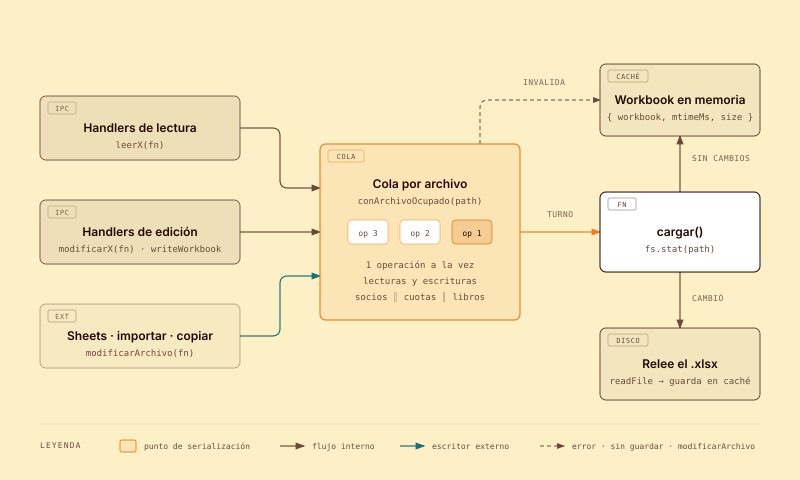
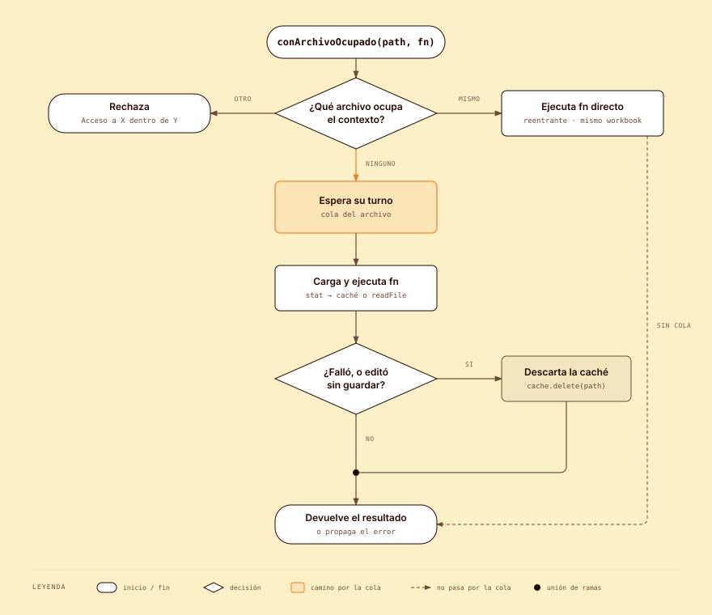

# Caché en memoria y cola por archivo para los Excel

Todo acceso a los archivos `.xlsx` de la app (`socios`, `cuotas`, `libros`, `prestamos_historial`)
pasa por `electron/utils/hojaExcel.ts`. El módulo resuelve tres cosas:

1. **Caché:** cada workbook queda en memoria y solo se relee de disco si el archivo cambió.
2. **Exclusión:** las operaciones sobre un mismo archivo se ejecutan de a una, en orden de llegada.
3. **Escritores externos:** el script de Google Sheets, la importación completa y la copia de
   respaldo esperan su turno en la misma cola y, al terminar, fuerzan la relectura.

## Arquitectura



<sub>Fuente editable: [`diagramas/flujo-cache-y-cola.html`](diagramas/flujo-cache-y-cola.html)</sub>

### Módulo `electron/utils/hojaExcel.ts`

Estado a nivel de módulo:

| Estructura | Contenido |
|---|---|
| `cache: Map<path, { workbook, mtimeMs, size }>` | Último workbook cargado o guardado de cada archivo. |
| `colas: Map<path, Promise>` | Última operación encolada de cada archivo. |
| `archivoOcupado: AsyncLocalStorage<Contexto>` | Qué archivo ocupa el flujo async actual. |

El `Contexto` de una operación guarda `path`, el `workbook` ya cargado y dos banderas: `editado`
(la operación puede modificar el archivo) y `escrito` (se llamó a `writeWorkbook`).

API pública:

| Función | Carga workbook | Puede guardar | Descarta la caché cuando… |
|---|---|---|---|
| `leerHoja(path, hoja, fn, crearSiFalta?)` | sí | no (el tipo `HojaLectura` no expone `writeWorkbook`) | `fn` tira |
| `modificarHoja(path, hoja, fn, crearSiFalta?)` | sí | sí (`writeWorkbook`) | `fn` tira, o termina sin haber llamado a `writeWorkbook` |
| `modificarArchivo(path, fn)` | no | — | siempre, al terminar |
| `vaciarCache()` | — | — | siempre (uso en tests) |

`Hoja` indica acceso a una hoja a través de ExcelJS; `Archivo`, al `.xlsx` completo sin ExcelJS.

Los callbacks pueden ser síncronos o `async` (`T | Promise<T>`). El callback recibe
`{ worksheet }` (lectura) o `{ worksheet, writeWorkbook }` (edición); `worksheet` es `undefined` si
la hoja no existe.

### Envoltorios en `electron/constants.ts`

Cada archivo tiene un par que fija ruta y nombre de hoja:

```ts
export const leerSocios   = <T>(fn: Lectura<T>) => leerHoja(SOCIOS_XLSX_PATH, 'Hoja1', fn)
export const modificarSocios = <T>(fn: Edicion<T>) => modificarHoja(SOCIOS_XLSX_PATH, 'Hoja1', fn)
```

| Archivo | Hoja | Lectura | Edición |
|---|---|---|---|
| socios | `Hoja1` | `leerSocios` | `modificarSocios` |
| cuotas | `original` | `leerCuotas` | `modificarCuotas` |
| libros | `Hoja1` | `leerLibros` | `modificarLibros` |
| historial | `prestamos` | `leerHistorial` | `modificarHistorial` |

El historial pasa además `crearHistorial` como `crearSiFalta`: si el archivo no existe, se crea con
sus columnas (`idPrestamo`, `fechaPrestamo`, `fechaDevolucion`, `nroSocio`, `nroLibro`) antes de
cargarlo, dentro de la cola.

Los handlers usan siempre estos envoltorios:

```ts
export const getLibros = async () => leerLibros(({ worksheet }) => { ... })

export const toggleCuota = async (...) =>
  modificarCuotas(async ({ worksheet, writeWorkbook }) => {
    // modificar la hoja
    await writeWorkbook()
  })
```

## Funcionamiento

### 1. Préstamo con callback (_loan pattern_)

El workbook no se devuelve al llamador: se le presta a un callback. Como la biblioteca controla el
inicio y el fin de la operación, puede liberar la cola, decidir si la caché sigue siendo válida e
invalidarla ante un error.

### 2. Cola por archivo (mutex basado en promesas)

```ts
const previa = colas.get(path) ?? Promise.resolve()
const siguiente = previa.catch(() => {}).then(ejecutar)
colas.set(path, siguiente)
```

- Hay una cola **por archivo**: operaciones sobre socios y libros corren en paralelo.
- Lecturas y escrituras comparten la cola. Una lectura nunca ve una edición a medias ni el momento
  en que la caché se reemplaza.
- `previa.catch(() => {})` hace que una operación fallida no bloquee ni contamine a la siguiente; el
  error llega solo a quien la pidió. La operación no se reintenta.

### 3. Caché validada por `mtime` + tamaño

`cargar()` se ejecuta al comienzo de cada `leerHoja` / `modificarHoja`:

1. Si el contexto ya tiene workbook (operación reentrante), lo devuelve.
2. `fs.stat` del archivo. Si no existe y hay `crearSiFalta`, lo crea y vuelve a hacer `stat`.
3. Si hay entrada en caché y coinciden `mtimeMs` y `size` → devuelve el workbook en memoria.
4. Si no → `readFile` y guarda la entrada nueva.

`writeWorkbook` hace `writeFile`, marca `escrito` y actualiza la entrada con el `stat` posterior. La
escritura propia no provoca una relectura en la operación siguiente.

### 4. Reentrancia y anidamiento con `AsyncLocalStorage`

Una operación que, estando dentro de un archivo, pide ese mismo archivo quedaría esperando detrás de
sí misma. `conArchivoOcupado()` lo evita consultando el contexto async actual:



<sub>Fuente editable: [`diagramas/flujo-tomar.html`](diagramas/flujo-tomar.html)</sub>

| Situación | Comportamiento |
|---|---|
| Sin archivo ocupado | Se encola normalmente. |
| Mismo archivo ya ocupado | **Reentrante**: `fn` corre directo, con el mismo workbook (ve los cambios aún no guardados). |
| Otro archivo ocupado | Rechaza con `Acceso a X dentro de Y`. |

Caso real de reentrancia: `actualizarFechaDevolucion` llama a `getHistorialLibro` dentro de su
`modificarHistorial`.

Prohibir el anidamiento entre archivos evita el deadlock cruzado (A tiene libros y espera historial,
B tiene historial y espera libros). Si alguien lo introduce, falla en los tests en lugar de colgar la
app.

Las reglas de invalidación se evalúan solo al cerrar la operación **externa**: una lectura anidada no
descarta cambios que la edición externa todavía va a guardar.

### 5. Escritores externos

Todo lo que escribe un `.xlsx` sin pasar por `modificarHoja` va envuelto en `modificarArchivo`:

| Código | Archivo | Qué hace dentro de la cola |
|---|---|---|
| `ejecutarSincronizacionDesdeSheets` | libros | Ejecuta el script `ActualizarExcelDesdeSheets.ps1`. |
| `importarExcelCompleto` | socios, cuotas, libros | Escribe cada archivo con la hoja importada, uno por uno. |
| `copiarExcel` | el archivo copiado | `copyFile` a la ruta elegida. |

`exportarExcelCompleto` lee los tres archivos con `leerHoja`, uno después del otro, y escribe el
archivo de destino (que no está cacheado) fuera de la cola.

Los diálogos de selección de archivo se muestran antes de entrar a la cola: mientras el usuario
elige una ruta, el archivo no queda bloqueado.

### 6. Operaciones sobre varios archivos

Nunca se anidan. Cada archivo se toma en una operación propia, en secuencia:

| Handler | Secuencia |
|---|---|
| `addLibroPrestado` | `modificarLibros` → `insertarHistorial` (`modificarHistorial`) |
| `devolverLibro` | `modificarLibros` → `actualizarFechaDevolucion` (`modificarHistorial`) |
| `editarDatosLibro` | `modificarLibros` → `actualizarNroLibroEnHistorial` (`modificarHistorial`) |
| `createSocio` | `modificarSocios` → `modificarCuotas` |
| `cambiarNombreSocio` | `modificarSocios` → `modificarCuotas` → `modificarLibros` |

El callback del primer archivo devuelve lo necesario y la segunda operación se hace afuera.

## Decisiones de diseño

| Decisión | Motivo |
|---|---|
| `leerHoja` y `modificarHoja` separados | Una lectura no tiene `writeWorkbook` en su tipo, y una edición que muta sin guardar se descarta sola. La caché no depende de revisar cada handler. |
| Invalidar la caché ante cualquier error | El workbook pudo quedar mutado a medias. Releer cuesta un `readFile`; servir datos corruptos cuesta mucho más. |
| `modificarArchivo` invalida siempre | Los escritores externos no dependen solo del `mtime` para que la app vea sus cambios. |
| Las lecturas no escriben | `getCuotasSocio` y el resto de las lecturas no modifican la hoja: con caché, una mutación en una lectura terminaría en disco en la siguiente edición. |
| Una sola estructura en memoria, sin límite | Son cuatro archivos fijos. No hace falta LRU ni expiración. |

## Reglas para quien escriba un handler nuevo

1. Usar `leerX` si solo se lee y `modificarX` si se modifica. Nunca abrir un `.xlsx` con `new ExcelJS.Workbook()`
   desde un handler.
2. Dentro de un `modificarX`, si se modificó la hoja hay que llamar a `writeWorkbook()`. Si no se llama, los
   cambios se descartan (a propósito).
3. Dentro de un `leerX`, no modificar la hoja.
4. Dentro de un callback solo se trabaja sobre la hoja. **No** esperar diálogos, IPC ni procesos
   externos: el archivo queda bloqueado hasta que el callback termine.
5. No tocar otro archivo desde dentro de un callback. Devolver lo necesario y hacer la segunda operación
   afuera.
6. Leer el mismo archivo desde adentro (por ejemplo, llamar a otro handler de lectura) está permitido.
7. Cualquier código que escriba un `.xlsx` sin ExcelJS (scripts, copias) va envuelto en `modificarArchivo`.

## Limitaciones conocidas

- **`mtime` + tamaño no es infalible.** Un reemplazo externo con el mismo `mtime` y el mismo tamaño no se
  detecta. Los escritores de la app invalidan explícitamente con `modificarArchivo`, así que el único caso sin
  cubrir es una edición manual en ese borde exacto. Si apareciera, agregar un hash del archivo.
- **Un callback que no termina bloquea el archivo.** En particular, `execFile` del script de Sheets no
  tiene timeout: si el script se cuelga, todas las operaciones sobre `libros.xlsx` esperan. Pendiente:
  pasar `{ timeout }` a `execFileAsync`.
- **Sin atomicidad entre archivos.** Si la app se cae entre la escritura de socios y la de cuotas en
  `createSocio`, los archivos quedan inconsistentes.
- **Sin escritura atómica.** `writeFile` sobrescribe en el lugar; un corte a mitad de la escritura
  puede corromper el archivo. Alternativa futura: escribir a un temporal y renombrar.
- **El estado es por proceso.** La caché y la cola viven en el proceso main de Electron; no coordinan
  con otra instancia de la app abierta sobre los mismos archivos.

## Tests

`tests/hojaExcel.unit.spec.ts` trabaja sobre archivos temporales reales, sin mocks:

| Caso | Qué garantiza |
|---|---|
| Dos lecturas seguidas devuelven el mismo workbook | Hay caché. |
| Escritura externa → la lectura siguiente ve el valor nuevo | La invalidación por `mtime` funciona. |
| Tres ediciones concurrentes que incrementan una celda → queda +3 | La cola serializa. |
| Edición que muta sin guardar → la lectura siguiente no la ve | Se descartan mutaciones no guardadas. |
| Callback que tira → corrió una sola vez y la lectura siguiente viene de disco | Sin reintentos; invalidación ante error. |
| `modificarArchivo` durante una edición pendiente → corre después y fuerza relectura | Escritores externos respetan la cola. |
| Leer el mismo archivo dentro de una edición → resuelve y ve el cambio sin guardar | Reentrancia, sin auto-bloqueo. |
| Leer otro archivo dentro de una edición → rechaza | Anidamiento cruzado detectado. |

Los specs que mockean ExcelJS (por ejemplo `tests/toggleCuota.unit.spec.ts`) llaman a `vaciarCache()`
en `beforeEach`: los specs corren en paralelo compartiendo `tests/fixtures/`, y sin vaciarla un test
podría recibir un workbook cacheado por otro.
